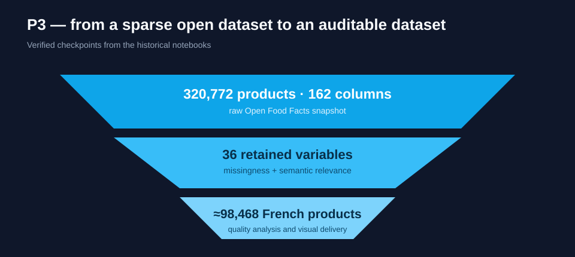

# Open Food Facts — Data Quality Pipeline

A reproducible data-cleaning case study built on the public Open Food Facts dataset. It demonstrates schema validation, missing-value analysis, duplicate handling and defensible filtering rules on real-world product data.

## What this project demonstrates

- profiling a wide, sparse dataset;
- separating reusable cleaning logic from notebook exploration;
- detecting invalid barcodes and duplicate products;
- documenting every row-removal rule;
- testing transformations on synthetic fixtures;
- avoiding redistribution of the large raw dataset.

## Quick start

```bash
python3 -m venv .venv
source .venv/bin/activate
pip install -e .[dev]
pytest
python scripts/build_recruiter_notebook.py
jupyter lab notebooks/00_recruiter_case_study.ipynb
```

Python 3.11 or newer is required. The recruiter notebook runs on the synthetic fixture.

For the separate raw-data notebook, place a legally obtained Open Food Facts CSV in `data/raw/`; this directory is ignored by Git. The raw-data notebook reads tab-separated exports with barcodes preserved as text.

## Case-study gallery

The original `master` notebook and six `dev` experiments are represented by five complementary views:

| Study | Focus |
|---|---|
| **[Recruiter case study](notebooks/00_recruiter_case_study.ipynb)** | **executed 8–10 minute path: historical evidence, architecture, cleaning impact and leakage-aware imputation** |
| [01 — Qualitative audit](notebooks/01_qualitative_audit.ipynb) | semantics, units, categories and suspicious values |
| [02 — Quantitative profile](notebooks/02_quantitative_profile.ipynb) | missingness, distributions, cardinality and correlations |
| [03 — Cleaning decisions](notebooks/03_cleaning_decisions.ipynb) | traceable rules and before/after impact |
| [04 — Quality scorecard](notebooks/04_quality_scorecard.ipynb) | completeness, validity, uniqueness and consistency |
| [05 — Interactive delivery](notebooks/05_interactive_delivery.ipynb) | Plotly/Voilà design translated into a lightweight reporting contract |
| [End-to-end pipeline](notebooks/open_food_facts_quality.ipynb) | local raw-export workflow (requires a downloaded dataset) |
| [06 — Historical evidence](notebooks/06_historical_evidence.ipynb) | verified dataset scale, missingness and feature-reduction decisions |

## Full historical studies

The compact case studies above are entry points (02–04 use explicitly illustrative numbers), not substitutes for the original work. Five substantial notebooks from the historical `dev` branch are preserved with their analytical outputs after automated removal of workstation paths and transient metadata:

| Historical notebook | Evidence retained |
|---|---|
| [End-to-end preparation — 255 cells](notebooks/historical/P3_01_notebook.ipynb) | selection, cleaning, exploration, imputation and interpretation |
| [Quantitative study — 210 cells](notebooks/historical/p3_quant.ipynb) | distributions, outliers, correlations, multivariate analysis and PCA |
| [Qualitative study — 26 cells](notebooks/historical/p3_qual.ipynb) | categorical semantics, missingness combinations and text/category exploration |
| [Plotly study](notebooks/historical/P3_01_plotly.ipynb) | interactive visual-analysis experiments |
| [Voilà study](notebooks/historical/P3_01_voila.ipynb) | dashboard-oriented delivery experiment |

These notebooks are explicitly labelled as historical evidence. The maintained implementation in `src/off_quality` demonstrates the current engineering standard: typed domain objects, immutable reports, composable strategies, fit/transform separation and per-chunk execution. `run_stream` cleans each chunk independently: duplicates across chunks and global sparse-column selection require caller coordination. This separation makes the technical progression visible without rewriting history.

The unrelated course-practice notebook is not presented as project evidence; the public story stays focused on health-data preparation.

## Historical evidence and current competencies

The original `dev` work is a substantial data-quality study, not a single cleaning script:

- **320,772 products × 162 columns** in the Open Food Facts source snapshot;
- systematic missingness profiling and reduction to **36 decision-relevant columns**;
- French-market subset of approximately **98,468 products**;
- barcode-format controls, duplicate analysis, type conversion and domain-range inspection;
- qualitative analysis of names, brands, countries, categories and Nutri-Score fields;
- quantitative distributions, correlations, iterative imputation and PCA;
- Plotly exploration and a Voilà-oriented interactive delivery notebook.



The [historical notebook inventory](docs/experiment_inventory.md) maps each branch artifact to the cleaned public pipeline and records the limitations of the source snapshot.

## Architecture

```text
src/off_quality/       validation and cleaning functions
notebooks/             recruiter narrative plus sanitised historical evidence
scripts/               reproducible import and privacy-sanitisation tooling
tests/                 synthetic, deterministic fixtures
data/README.md         data provenance instructions
```

## Responsible use

Cleaning thresholds change the population represented by the dataset. The notebook reports before/after row counts and treats nutrition analysis as exploratory, not medical advice.

## Automated quality gate

The CI enforces linting, strict static typing, unit tests and a fresh execution of the recruiter notebook. Historical notebooks are intentionally excluded from modern linting: they remain evidence of the original exploration, while every maintained module must pass the current engineering standard.

## License

Code is released under the [MIT License](LICENSE). Open Food Facts data remains governed by its own terms. Historical outputs retain source excerpts; the full raw export is not bundled. The CI fixture is synthetic.
